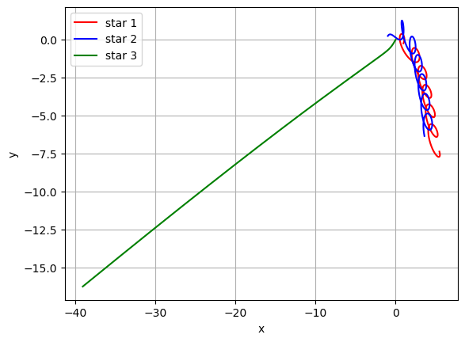

# Modelling Binary and Triple Star Systems

Stellar systems are governed by Newton's laws of motion. From Newton's laws, we can derive the Ordinary Differential Equations (ODEs) that determine the orbital trajectories of the bodies in the system. The aim of this project is to solve these equations to model the following three scenarios in **two dimensions**: 
1. A two-body system made up of two stars with a mass ratio 1:2 undergoing multiple stable orbits.    For N stars in the system, the ODE for the x-position of each star is:   $$\frac{d^2 x_i}{dt^2} = \sum_{\substack{j=1 \\ j \neq i}}^{j=N} \frac{GM_j}{r_{ij}^2} \cos(\theta)$$ Similarly, the ODE for the y-position is: $$\frac{d^2 y_i}{dt^2} = \sum_{\substack{j=1 \\ j \neq i}}^{j=N} \frac{GM_j}{r_{ij}^2} \sin(\theta)$$ where

- $r_{ij} = \sqrt{(x_i - x_j)^2 + (y_i - y_j)^2}$
- $\cos \theta = \frac{(x_j - x_i)}{r_{ij}}$
- $\sin \theta = \frac{(y_j - y_i)}{r_{ij}}$

2. The stable solution of a three-body system that was discovered by Cris Moore and proved by Chenciner and Montgomery, described [here](https://arxiv.org/abs/math/0011268). The 3 stars have equal mass and are assumed to be point-like objects which cannot collide. Needless to say, such a system has not yet been observed in nature. For the vast majority of cases, three-star systems consist of two stars closely orbiting each other with the third star orbiting the binary pair at a much larger distance.

3. A chaotic solution of a three-body system where one star gets ejected from the system.

We will be using numerical integration methods to solve the ODEs. The first method involves the use of the **solve_ivp()** function which, by default, uses the Runge-Kutta numerical technique of order 4 and 5 to find the solution. The second is the **Midpoint** method which is a second-order method that is very similar to Euler's method but uses an intermediate step to increase the estimation accuracy. 

## Results:

*Figure 1: A stable binary system.*

 

*Figure 2: The stable solution of a triple star system.*

 

*Figure 3: A chaotic triple star system.*

 

Please refer to the [Jupyter Notebook](modelling_binary_and_triple_star_systems_code.ipynb) to inspect the code and more results.
